# F21DL Portfolio / Brain tumors MRIs dataset 
By Y. SCHLOSSER, T. ADELEKE, A. KHA, S. SHAH, A. HARIS

This repo contains a portfolio made for the course of Data-Mining (F21DL), delivered by Mrs Komendatskaya at Heriot-Watt University. Different classical Machine Learning techniques were employed to classify brain tumors from an MRI dataset. Neural networks are investigated in the last 2 labs. We present in this README a short summary of the 10 labs.

## Lab 1 : Dataset choice

The first lab was dedicated to discuss and choose a dataset to investigate during the following weeks.
3 medical datasets were studied, but the one which apeared as the more convincing was the __Brain Tumor Classification (MRI)__ dataset, available at https://www.kaggle.com/datasets/sartajbhuvaji/brain-tumor-classification-mri. This dataset can be used for real life applications, and appears to be challenging by the variety of images contained in it. For all the following labs, the images will be resized to (255, 255), and reduced to a single grayscale channel (instead of the RGB channels, still rendering a grayscale aspect).

  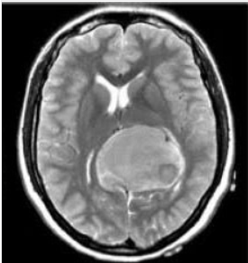

$$Figure \ 1 \ : Example \ of \ Meningioma \ tumor \ in \ the \ dataset$$

## Lab 2 : Dataset exploration

This lab was dedicated to visualizing and extracting some statistics from the dataset. Each tumor has visual specificities but can still be hard to classify because of its size and the angle (or view) it is seen from.
While the dataset is balanced among the three tumor classes, the "no tumor" is less represented, which is to be taken in account in the next labs. Here is the repartition of the training set :
- glioma_tumor : 826 images
- meningioma_tumor : 822 images
- no_tumor : 395 images
- pituitary_tumor : 827 images

  

$$Figure \ 2 \ : Pie \ chart \ of \ the \ dataset$$

## Lab 3 : Feature extraction

Each sample of the dataset is a (255, 255) image; so, after flattening, samples are 65025-feature vectors. This can be very challenging and computationally intensive to process. 3 feature extraction methods have been investigated in this lab : Mutual Info, F-Statistic and Principal Components Analsis (PCA). Note that PCA uses a transformation on the data, in contrast to the others, which extract only relevant features (pixels). 

  

$$Figure \ 3 \ : Original \ image \ vs \ PCA \ inverse \ transform$$

PCA has demonstrated better results (by a significant margin) than the other methods  in terms of accuracy, assessed using an SVM (Support Vector Machine) classifier. This method consists in projecting the data in a less dimensional space while conserving the maximum of explained variance (and thus, information) of the dataset.
Therefore, PCA will be used as a pre-processing technique in some of the following labs.

  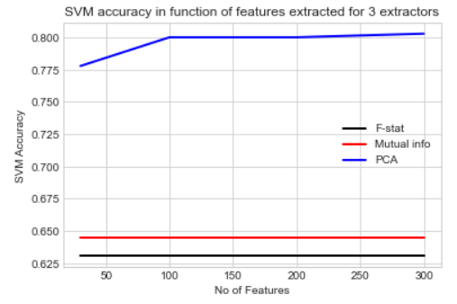

  $$Figure \ 4 \ : SVM \ Accuracy \ comparison \ between \ feature \ extraction \ methods$$

## Lab 4 : Evaluation Metrics

In this lab, we evaluate the accuracy of some models according to different metrics, and try to see if some are more relevant than others. It appears that accuracy remains a strong indicator of performance. f1-score is relevant as well. The AUC score, which traduces the trade-off between TPR and FPR however, can be seen as less relevant. Indeed, we see that it can produce good results even when the precision or recall are low (or even equal to 0). It can be explained by the fact that it evaluates the models in binary cases (which can produce somewhat good results, in "One Vs All" or "One Vs One" strategies), rather than in the multi-class case.

  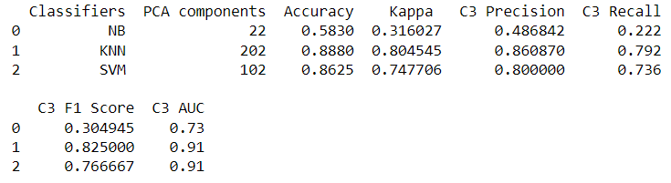

  $$Figure \ 5 \ :  Different \ metric \ results \ on \ the \ dataset$$

## Lab 5 : Bayesian Networks

The goal of this lab is to understand Bayes classifiers and try it on the dataset. 
Most are naive Bayes models, valid when features are conditionally independant, expressed by : $$P(C_{k}|x)  \propto P(C_{k})\prod \limits_{i=1}^{n} P(x_{i}| C_{k})$$
$$\hat{y} = \underset{k}{argmax} \ \{P(C_{k})\prod \limits_{i=1}^{n} P(x_{i}| C_{k})\} $$
Most efficient Bayes models were the Complement one, supposedly because it deals better with unbalanced data (by computing the complementary probas instead of the standard ones); as well as the Complex Gaussian Bayes, which is not surprising as it removes the abusive hypothesis of feature independance, and therefore, is more general.
The conclusion of this study is that Bayes models are not suitable to our dataset in general, with maybe the exception of Complex Gaussian Bayes which performs pretty well. Indeed, after applying PCA, the data distribution is not really known, but is not likely to follow - for example - Bernoulli or multinomial models either. Therefore, such hypothesis on the data distribution can be highly abusive and produce poor results.

  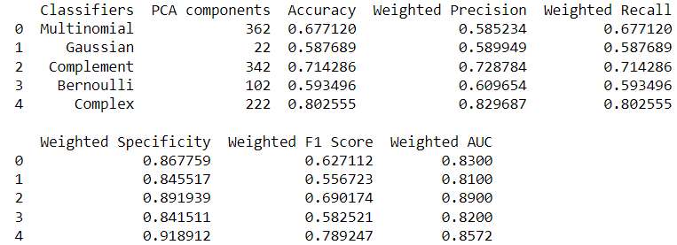

  $$Figure \ 6 \ :  Different \ Bayesian \ models \ results$$

## Lab 7 : Clustering

Lab 7 was dedicated to investigation of the unsupervised ML technique known as clustering. The idea is simple and consists in separating samples in clusters, which will correspond to their attributed class.
Different clustering methods were used, such as K-means, Gaussian Mixture and Agglomerative clustering, but in general results were very poor and demonstrated that the data was not separable in obvious clusters.

  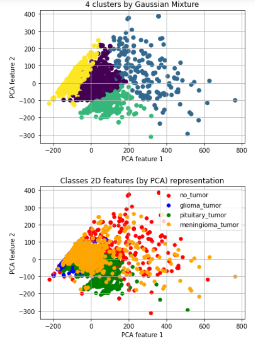

  $$Figure \ 7 \ :  Gaussian \ Mixture \ clusters \ vs \ Real \ classes \ clusters \ in \ 2D \ (PCA)$$

## Lab 8 : Decision trees

Decision trees (DT) were studied here. The principle remains very simple, consisting in splitting a tree's nodes in function of the feature values, which leads to a classification decision on the terminal leaves.

  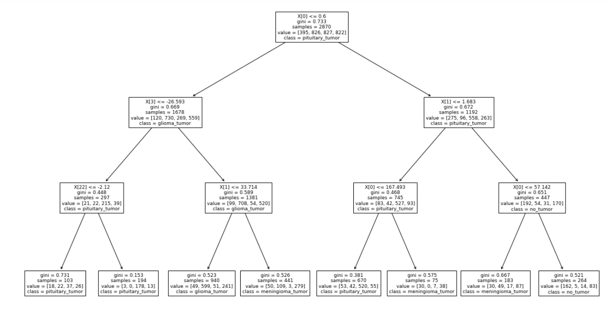

  $$Figure \ 8 \ :  Example \ of \ Decision \ Tree \ issued \ from \ the \ dataset \ (max \ depth \ = \ 3)$$
  
We tried variations of the DT's hyperparameters, adn the results of this investigation are summarized in the following table. The hyperparameter columns shows the hyperparameter which was changed while others were taken at their default value (in sklearn). We see that default parameters work in general better, and that the entropy impurity works slightly better than the well known gini one. Peak accuracy reached is good, but not excellent either :

  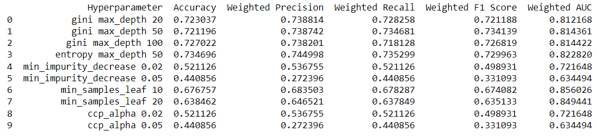

  $$Figure \ 9 \ :  Hyperparameters \ variations \ of \ the \ Decision \ Tree \ and \ performance $$
  
A variation of the DT, called Random Forest, outperforms the tradition DT, which is not unusual. It uses bagging and feature randomness when building the tree's nodes.
With a test size of 30%, the accuracies reached are the following :

  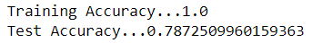

We notice overfitting as there is a considerable difference between the training and the testing accuracies. However, this latter can be considered as pretty good.

## Lab 9 : Linear and Logistic Regression

Linear and logistic Regression represent the fundamentals of the more advanced models of neural nets (MLP). In this lab we try to search for the optimal hyperparameters of the Regression, but notice that this model often leads to huge overfitting. The most significant hyperparameter is the loss specification. With no suprise, however, we see that classification losses (like log entropy and hinge) perform way better than regression losses (like MSE).

  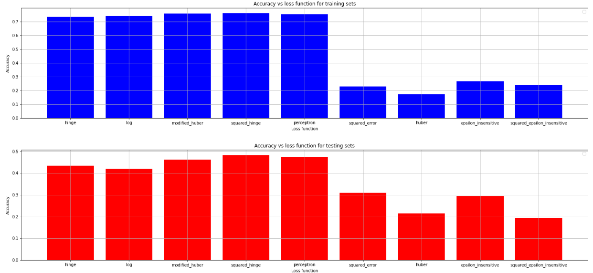

  $$Figure \ 10 \ :  Regression \ classifier \  performance \ with \ different \ losses $$

## Lab 10 : Multi-Layer Perceptron (MLP)

In the last 2 labs we use classical neural networks for the classification task. The first one is the MLP, which uses various layers, composed of neurons which function each, similarly to the Logistic Regression classifier (particular case of 1 perceptron with sigmoid activation).
Different types of architectures and hyperparameter were tried. The sklearn default ones seem to be the best ("adam" optimizer , "relu" activation).

  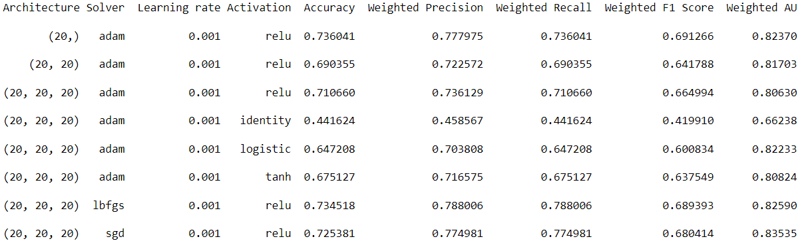

  $$Figure \ 11 \ :  MLP \ architectures \  performance$$
  
A grid search has also been performed, which gives the following best parameters :

  

With a test size of 60% and these parameters, we enhanced the generalization power of the MLP as the overfitting has been reduced significantly, and we even reached the best accuracy so far :

  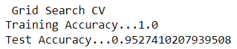

## Lab 11 : Convolutional Networks (CNN)

In this final lab we study CNNs by trying, rather blindly, some architectures. This time, we do not use PCA as pre-processing, only the raw images. In general, we notice that low size kernels, strides and pool sizes give better results, as the CNN can get more local properties of images. Processing time is however very long in this case.
The results are average but tend to increase with the number of epochs. However, as underlined previously, the training time can be considerably long.
We are confident that with more testing, we can reach better performance, as some kaggle notebooks succeed in reaching 90% accuracy and more on the same dataset, and using CNNs.
Here are some results on the third architecture tried :

  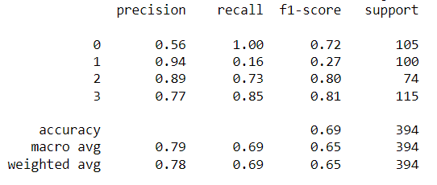

  $$Figure \ 12 \ :  CNN \  performance \ on \ architecture \ 3$$

