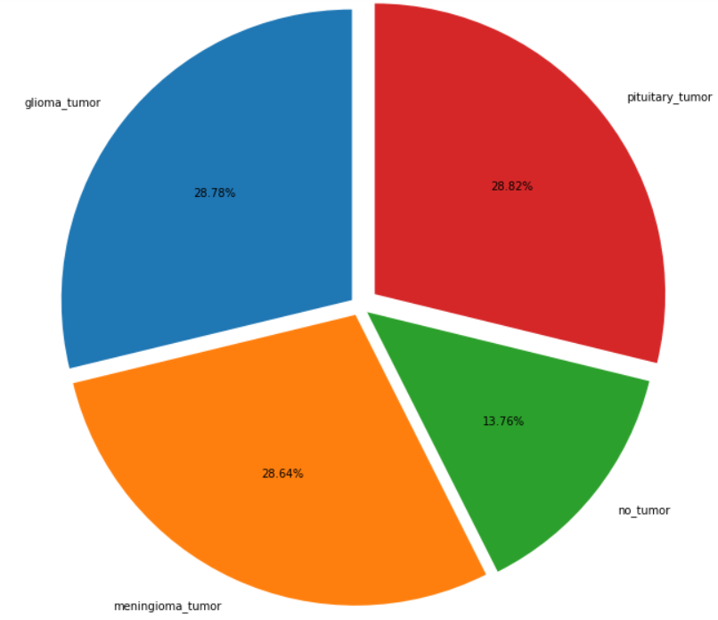

# F21DL Portfolio / Brain tumors MRIs dataset 
By Y. SCHLOSSER, T. ADELEKE, A. KHA, S. SHAH, A. HARIS

This repo contains a portfolio made for the course of Data-Mining (F21DL), delivered by Mrs Komendatskaya at Heriot-Watt University. Different classical Machine Learning techniques were employed to classify brain tumors from an MRI dataset. Neural networks are investigated in the last 2 labs. W present in this README a short summary of the 10 labs.

## Lab 1 : Dataset choice

The first lab was dedicated to discuss and choose a dataset to investigate during the following weeks.
3 medical datasets were studied, but the one which apeared as the more convincing was the __Brain Tumor Classification (MRI)__ dataset, available at https://www.kaggle.com/datasets/sartajbhuvaji/brain-tumor-classification-mri. This dataset can be used for real life applications, and appears to be challenging by the variety of images contained in it.

  

$$Figure \ 1 \ : Example \ of \ Meningioma \ tumor \ in \ the \ dataset$$

## Lab 2 : Dataset exploration

This lab was dedicated to visualizing and extracting some statistics from the dataset. Each tumor has visual specificities but can still be hard to classify because of its size and the angle (or view) it is seen from.
While the sataset is balanced among the three tumor classes, the "no tumor" is less represented, which is to be taken account in the next labs. Here is the repartition of the training set :
- glioma_tumor : 826 images
- meningioma_tumor : 822 images
- no_tumor : 395 images
- pituitary_tumor : 827 images

  

$$Figure \ 2 \ : Pie \ chart \ of \ the \ dataset$$

## Lab 3 : Feature extraction

## Lab 4 : Evaluation Metrics

## Lab 5 : Bayesian Networks

## Lab 7 : Clustering

## Lab 8 : Decision trees

## Lab 9 : Linear and Logistic Regression

## Lab 10 : Multi-Layer Perceptron

## Lab 11 : Convolutional Networks
