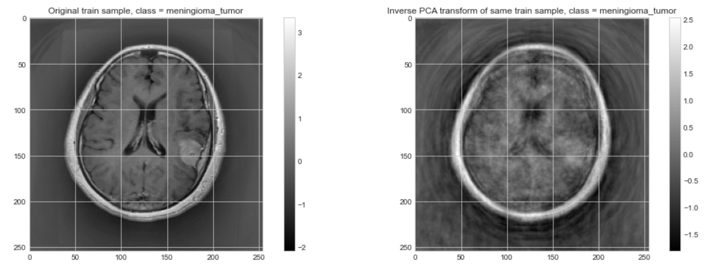

# F21DL Portfolio / Brain tumors MRIs dataset 
By Y. SCHLOSSER, T. ADELEKE, A. KHA, S. SHAH, A. HARIS

This repo contains a portfolio made for the course of Data-Mining (F21DL), delivered by Mrs Komendatskaya at Heriot-Watt University. Different classical Machine Learning techniques were employed to classify brain tumors from an MRI dataset. Neural networks are investigated in the last 2 labs. W present in this README a short summary of the 10 labs.

## Lab 1 : Dataset choice

The first lab was dedicated to discuss and choose a dataset to investigate during the following weeks.
3 medical datasets were studied, but the one which apeared as the more convincing was the __Brain Tumor Classification (MRI)__ dataset, available at https://www.kaggle.com/datasets/sartajbhuvaji/brain-tumor-classification-mri. This dataset can be used for real life applications, and appears to be challenging by the variety of images contained in it.

  

$$Figure \ 1 \ : Example \ of \ Meningioma \ tumor \ in \ the \ dataset$$

## Lab 2 : Dataset exploration

This lab was dedicated to visualizing and extracting some statistics from the dataset. Each tumor has visual specificities but can still be hard to classify because of its size and the angle (or view) it is seen from.
While the sataset is balanced among the three tumor classes, the "no tumor" is less represented, which is to be taken in account in the next labs. Here is the repartition of the training set :
- glioma_tumor : 826 images
- meningioma_tumor : 822 images
- no_tumor : 395 images
- pituitary_tumor : 827 images

  

$$Figure \ 2 \ : Pie \ chart \ of \ the \ dataset$$

## Lab 3 : Feature extraction

Each sample of the dataset is a (255, 255) image; so, after flattening, samples are 65025-feature vectors. This can be very challenging and computationally intensive to process. 3 feature extraction methods have been investigated in this lab : Mutual Info, F-Statistic and Principal Components Analsis (PCA). Note that PCA uses a transformation on the data, in contrast to the others, which extract only relevant features (pixels). 

  

$$Figure \ 3 \ : Original \ image \ vs \ PCA \ inverse \ transform$$

PCA has demonstrated better results (by a significant margin) than the other methods  in terms of accuracy, assessed using an SVM (Support Vector Machine) classifier. This method consists in projecting the data in a less dimensional space while conserving the maximum of explained variance (and thus, information) of the dataset.
Therefore, PCA will be used as a pre-processing technique in some of the following labs.

  

  $$Figure \ 4 \ : SVM \ Accuracy \ comparison \ between \ feature \ extraction \ methods$$

## Lab 4 : Evaluation Metrics

In this lab, we evaluate the accuracy of some models according to different metrics, and try to see if some are more relevant than others. It appears that accuracy remains a strong indicator of performance. f1-score is relevant as well. The AUC score, which traduces the trade-off between TPR and FPR however, can be seen as less relevant. Indeed, we see that it can produce good results even when the precision or recall are low (or even equal to 0). It can be explained by the fact that it evaluates the models in binary cases (which can produce somewhat good results, in "One Vs All" or "One Vs One" strategies), rather than in the multi-class case.

  

  $$Figure \ 5 \ :  Different \ metric \ results \ on \ the \ dataset$$

## Lab 5 : Bayesian Networks

The goal of this lab is to try and understand some Bayes classifiers on the dataset. 
Most are naive Bayes models, valid when features are conditionally independant, expressed by : $$P(C_{k}|x)  \propto P(C_{k})\prod \limits_{i=1}^{n} P(x_{i}| C_{k})$$
$$\hat{y} = \underset{k}{argmax} \{P(C_{k})\prod \limits_{i=1}^{n} P(x_{i}| C_{k})\} $$
Most efficient Bayes models were the Complement one, supposedly because it deals better with unbalanced data (by computing the complementary probas instead of the standard ones); as well as the Complex Gaussian Bayes, which is not surprising as it removes the abusive hypothesis of feature independance, and therefore is more general.
The conclusion of this study is that Bayes models are not suitable to our dataset in general, with maybe the exception of Complex Gaussian Bayes which performs pretty well. Indeed, after applying PCA, the data distribution model is not really known, but is not likely to correspond to - for example - Bernoulli or multinomial models either. Therefore, such hypothesis on the data distribution can be highly abusive and produce poor results.

  

  $$Figure \ 6 \ :  Different \ Bayesian \ models \ results$$

## Lab 7 : Clustering

## Lab 8 : Decision trees

## Lab 9 : Linear and Logistic Regression

## Lab 10 : Multi-Layer Perceptron

## Lab 11 : Convolutional Networks
